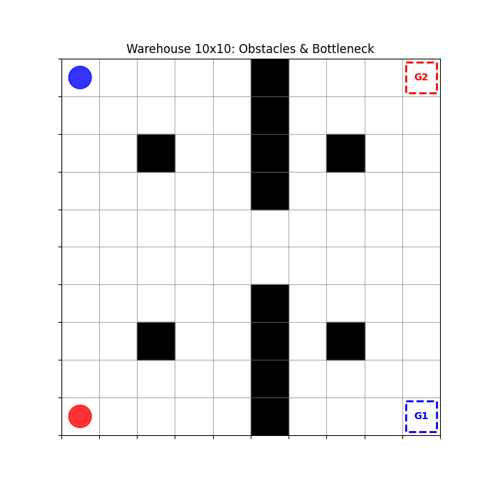

# 🤖 Multi-Agent Warehouse Logistics with Q-Learning📋 

## Project Overview

This project simulates a Multi-Agent Reinforcement Learning (MARL) environment to solve a logistics coordination problem. Two autonomous agents (robots) must navigate a 10x10 warehouse grid with obstacles and a central bottleneck, swapping start and goal positions without colliding with each other or the walls.The core algorithm is Tabular Q-Learning, implemented from scratch without external RL libraries (like Gymnasium or Stable-Baselines), to demonstrate a fundamental understanding of the Bellman Equation and Markov Decision Processes (MDPs).

## 🚀 Key Features

Multi-Agent Coordination: 

- Agents share the state space (Agent1_Pos, Agent2_Pos), allowing them to "see" each other and learn collision avoidance.

- Complex Environment: A 10x10 Grid with static obstacles and a central "bottleneck" that forces agent interaction.

- Model Persistence: Implemented a Save/Load system using pickle to separate the Training phase from the Inference (Demo) phase.

- Live Monitoring: Real-time training visualization using Matplotlib interactive mode.

- CLI Interface: Command-line arguments to switch modes (--mode train, --mode demo) and toggle live rendering (--live).

## 🧠 The Challenge: From 5x5 to 10x10

The most significant technical hurdle in this project was scaling the environment from a simple 5x5 open grid to a 10x10 grid with obstacles.

1. The Curse of Dimensionality

    Moving from a 5x5 grid to a 10x10 grid didn't just double the difficulty; it exploded the state space.

    5x5 Grid: ~625 states.

    10x10 Grid: $100 \times 100 = 10,000$ discrete states.

    Solution: I increased the training duration and tuned the epsilon_decay hyperparameter to ensure sufficient exploration of the larger map before exploiting the learned policy.

2. The "Reward Hacking" Bug

    During the initial training phase, I observed the agents achieving impossibly high scores (e.g., 7000+ points), yet they weren't finishing the episode efficiently.The Problem: The reward function gave +50 points every step an agent was on the goal. The first agent to arrive would simply wait on the goal for the second agent, accumulating infinite points.The Solution: I redesigned the environment logic to include boolean flags (self.agent_1_arrived). The +50 reward is now a sparse, one-time event triggered only at the moment of arrival. This forced the agents to optimize for speed rather than point farming.

## 🛠️ Tech Stack

Language: Python 3.x

Libraries:
- NumPy: Matrix operations and state management.

- Matplotlib: Custom environment rendering and animation.

- Pickle: Model serialization.

- Argparse: CLI management.
